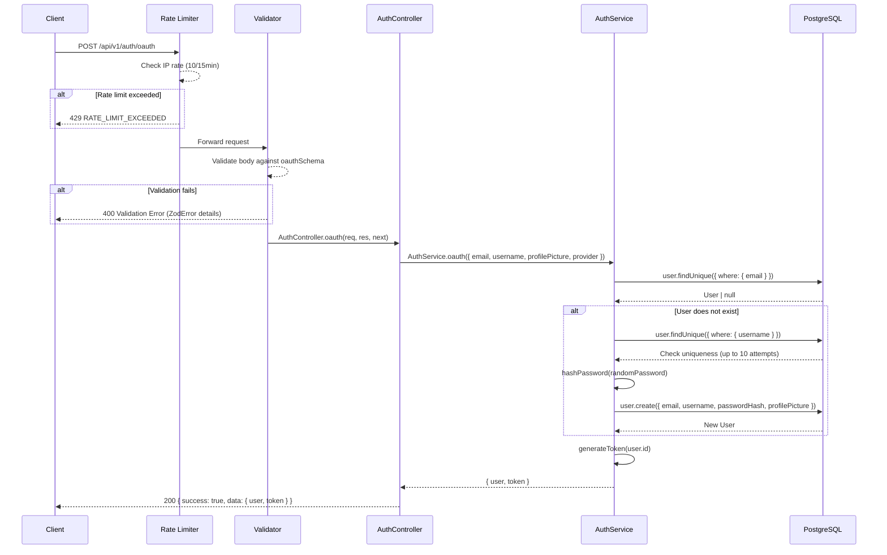
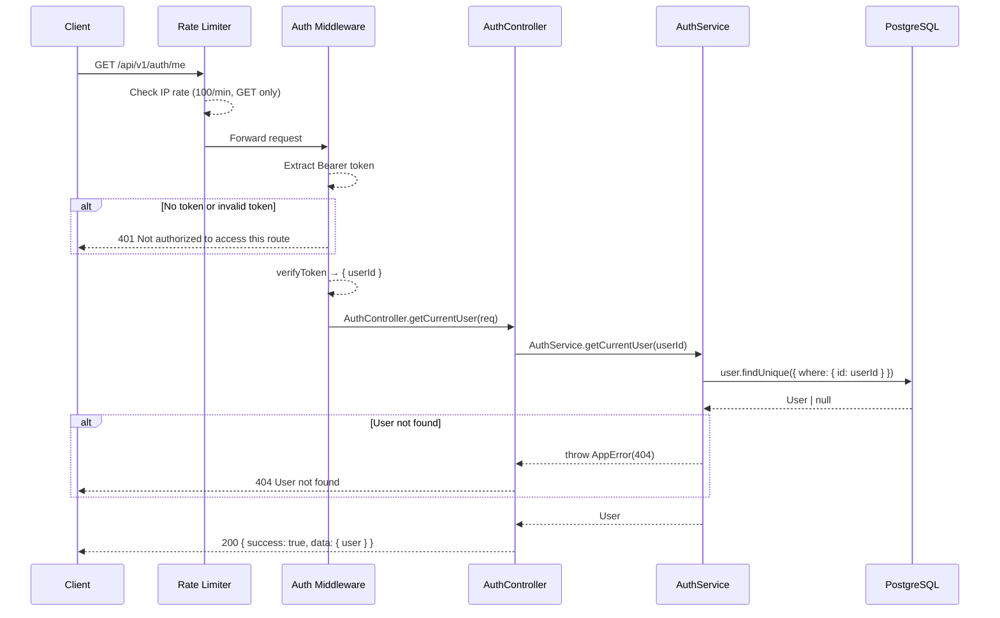

# Authentication API

Base path: `/api/v1/auth`

---

## POST `/api/v1/auth/oauth`

**OAuth Login / Registration**

| Property   | Value                                  |
| ---------- | -------------------------------------- |
| Auth       | None                                   |
| Rate Limit | `authLimiter` — 10 req / 15 min per IP |
| Validator  | `oauthSchema`                          |

### Flow Diagram



### Request

**Headers**

| Header       | Value            | Required |
| ------------ | ---------------- | -------- |
| Content-Type | application/json | Yes      |

**Body**

| Field          | Type   | Constraints                                      | Required |
| -------------- | ------ | ------------------------------------------------ | -------- |
| email          | string | Valid email address                               | Yes      |
| username       | string | min 1 character                                   | Yes      |
| profilePicture | string | Valid URL                                         | No       |
| provider       | enum   | `"google"` \| `"github"` \| `"facebook"` \| `"twitter"` | Yes      |

### Response

**200 OK** — Login or registration successful

```json
{
  "success": true,
  "data": {
    "user": {
      "id": "uuid",
      "username": "string",
      "email": "string",
      "profilePicture": "string | null",
      "createdAt": "ISO 8601"
    },
    "token": "JWT string"
  }
}
```

**400 Bad Request** — Validation error or unable to generate unique username

```json
{
  "success": false,
  "error": "Validation Error",
  "details": [{ "path": ["email"], "message": "Invalid email address" }]
}
```

**429 Too Many Requests**

```json
{
  "success": false,
  "error": {
    "message": "Too many authentication attempts, please try again later",
    "code": "RATE_LIMIT_EXCEEDED",
    "retryAfter": 900
  }
}
```

### Frontend Usage

| Component | Path |
| --------- | ---- |
| NextAuth JWT Callback | `frontend/auth.ts` — called via `handleOAuthBackend()` during Google, Twitter, and GitHub sign-in flows |
| SignInForm | `frontend/components/SignInForm.tsx` — triggers OAuth via `signIn()` from NextAuth |
| RegistrationForm | `frontend/components/RegistrationForm.tsx` — triggers OAuth via `signIn()` from NextAuth |

### Notes

- If a user with the given email already exists, the existing user is returned with a new JWT — no new account is created.
- For new users, a random password hash is generated (OAuth users never use it).
- If the requested username is taken, the service appends a random number suffix (up to 10 attempts).

---

## GET `/api/v1/auth/me`

**Get Current User**

| Property   | Value                                     |
| ---------- | ----------------------------------------- |
| Auth       | `protect` — Bearer token required          |
| Rate Limit | `generalLimiter` — 100 req / min per IP (GET) |

### Flow Diagram



### Request

**Headers**

| Header        | Value            | Required |
| ------------- | ---------------- | -------- |
| Authorization | Bearer `<token>` | Yes      |

### Response

**200 OK**

```json
{
  "success": true,
  "data": {
    "user": {
      "id": "uuid",
      "username": "string",
      "email": "string",
      "profilePicture": "string | null",
      "bio": "string | null",
      "createdAt": "ISO 8601"
    }
  }
}
```

**401 Unauthorized**

```json
{
  "success": false,
  "error": "Not authorized to access this route"
}
```

**404 Not Found**

```json
{
  "success": false,
  "error": "User not found"
}
```

### Frontend Usage

| Component | Path |
| --------- | ---- |
| — | Not directly imported by any component. Auth state is managed through NextAuth session callbacks in `frontend/auth.ts`. |
