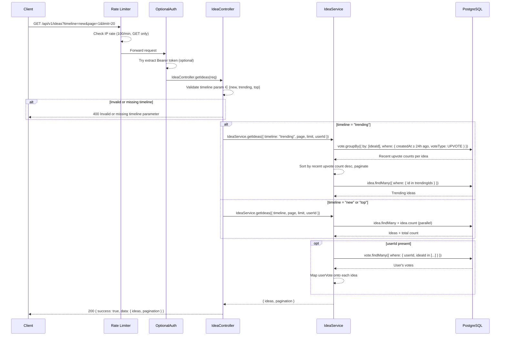
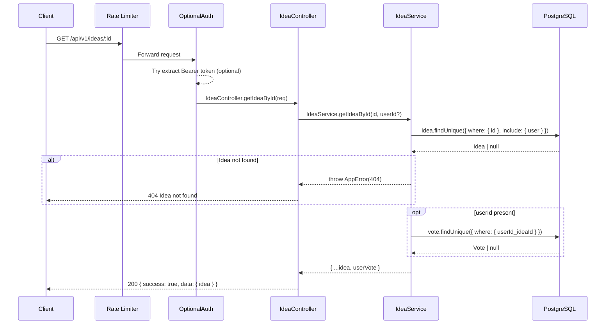
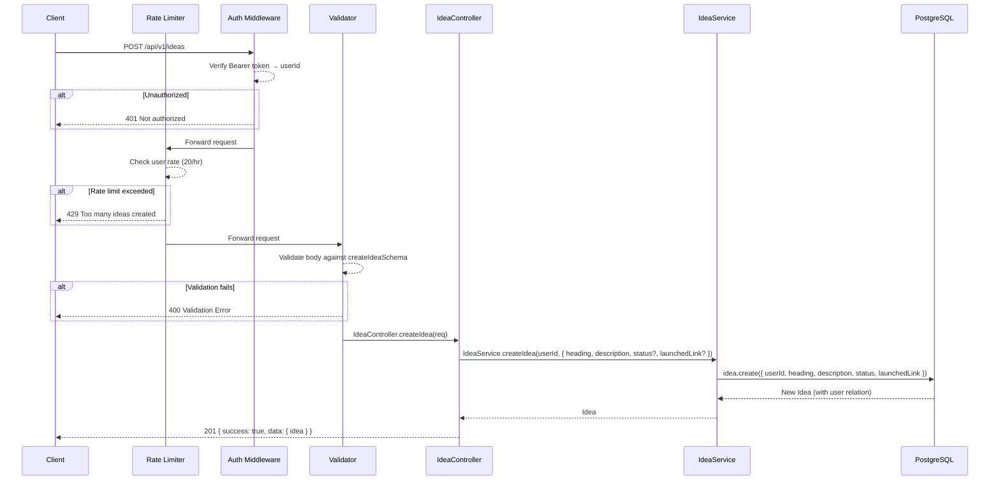
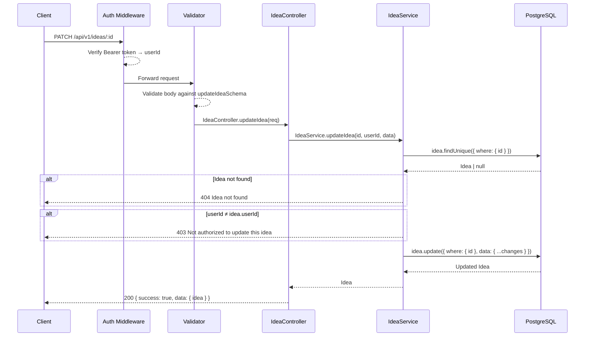
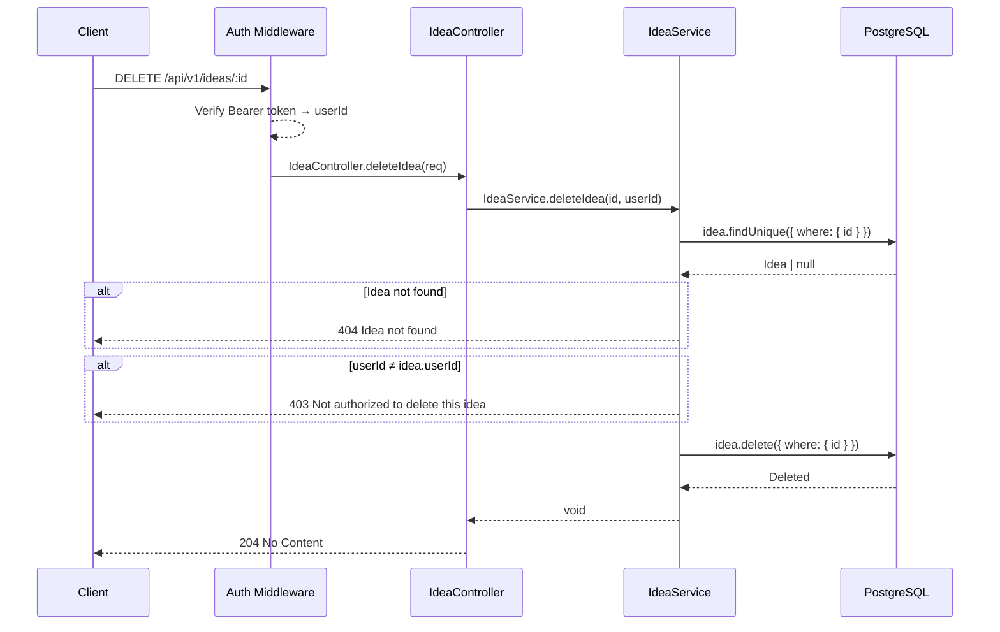
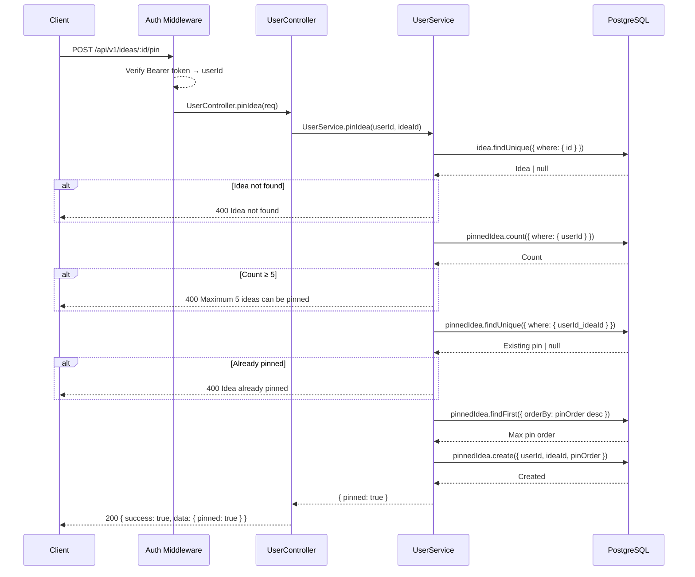
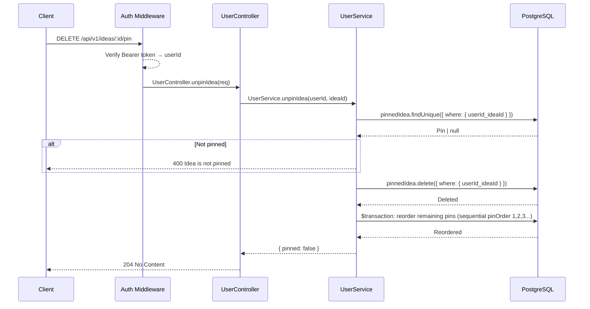

# Ideas API

Base path: `/api/v1/ideas`

---

## GET `/api/v1/ideas`

**Get Ideas (Timeline)**

| Property   | Value                                          |
| ---------- | ---------------------------------------------- |
| Auth       | `optionalProtect` — includes userVote if authed |
| Rate Limit | `generalLimiter` — 100 req / min per IP (GET)  |

### Flow Diagram



### Request

**Query Parameters**

| Param    | Type   | Constraints                    | Default | Required |
| -------- | ------ | ------------------------------ | ------- | -------- |
| timeline | string | `"new"` \| `"trending"` \| `"top"` | —       | Yes      |
| page     | number | ≥ 1                            | 1       | No       |
| limit    | number | ≥ 1                            | 20      | No       |

### Response

**200 OK**

```json
{
  "success": true,
  "data": {
    "ideas": [
      {
        "id": "uuid",
        "userId": "uuid",
        "heading": "string",
        "description": "string",
        "status": "DRAFT | VALIDATED | WIP | LAUNCHED",
        "launchedLink": "string | null",
        "upvotesCount": 0,
        "downvotesCount": 0,
        "commentsCount": 0,
        "createdAt": "ISO 8601",
        "updatedAt": "ISO 8601",
        "user": {
          "username": "string",
          "profilePicture": "string | null"
        },
        "userVote": "upvote | downvote | null"
      }
    ],
    "pagination": {
      "page": 1,
      "limit": 20,
      "total": 100,
      "total_pages": 5
    }
  }
}
```

### Notes

- **new**: Sorted by `createdAt` desc, then `id` desc.
- **trending**: Groups upvotes from the last 24 hours, sorted by recent upvote count desc. Ideas created at any time can trend if they received recent upvotes.
- **top**: Sorted by `upvotesCount` desc, then `createdAt` desc, then `id` desc.
- `userVote` is `null` for unauthenticated requests.

### Frontend Usage

| Component | Path |
| --------- | ---- |
| Timeline | `frontend/components/Timeline.tsx` — fetches ideas via `ideasApi.getIdeas()` |

---

## GET `/api/v1/ideas/:id`

**Get Idea by ID**

| Property   | Value                                          |
| ---------- | ---------------------------------------------- |
| Auth       | `optionalProtect` — includes userVote if authed |
| Rate Limit | `generalLimiter` — 100 req / min per IP (GET)  |

### Flow Diagram



### Request

**Path Parameters**

| Param | Type | Description |
| ----- | ---- | ----------- |
| id    | uuid | Idea ID     |

### Response

**200 OK**

```json
{
  "success": true,
  "data": {
    "idea": {
      "id": "uuid",
      "userId": "uuid",
      "heading": "string",
      "description": "string",
      "status": "DRAFT | VALIDATED | WIP | LAUNCHED",
      "launchedLink": "string | null",
      "upvotesCount": 0,
      "downvotesCount": 0,
      "commentsCount": 0,
      "createdAt": "ISO 8601",
      "updatedAt": "ISO 8601",
      "user": {
        "username": "string",
        "profilePicture": "string | null"
      },
      "userVote": "upvote | downvote | null"
    }
  }
}
```

**404 Not Found**

```json
{
  "success": false,
  "error": "Idea not found"
}
```

### Frontend Usage

| Component | Path |
| --------- | ---- |
| Idea Detail Page | `frontend/app/(app)/idea/[id]/page.tsx` — fetches idea via `ideasApi.getIdeaById()` |
| Idea Edit Page | `frontend/app/(app)/idea/[id]/edit/page.tsx` — fetches idea for editing via `ideasApi.getIdeaById()` |

---

## POST `/api/v1/ideas`

**Create Idea**

| Property   | Value                                       |
| ---------- | ------------------------------------------- |
| Auth       | `protect` — Bearer token required            |
| Rate Limit | `createIdeaLimiter` — 20 req / hr per user  |
| Validator  | `createIdeaSchema`                          |

### Flow Diagram



### Request

**Headers**

| Header        | Value            | Required |
| ------------- | ---------------- | -------- |
| Authorization | Bearer `<token>` | Yes      |
| Content-Type  | application/json | Yes      |

**Body**

| Field        | Type   | Constraints                                        | Required |
| ------------ | ------ | -------------------------------------------------- | -------- |
| heading      | string | min 1, max 200 characters                          | Yes      |
| description  | string | min 1 character                                    | Yes      |
| status       | enum   | `"DRAFT"` \| `"VALIDATED"` \| `"WIP"` \| `"LAUNCHED"` | No (default: `DRAFT`) |
| launchedLink | string | Valid URL                                          | No       |

### Response

**201 Created**

```json
{
  "success": true,
  "data": {
    "idea": {
      "id": "uuid",
      "userId": "uuid",
      "heading": "string",
      "description": "string",
      "status": "DRAFT",
      "launchedLink": null,
      "upvotesCount": 0,
      "downvotesCount": 0,
      "commentsCount": 0,
      "createdAt": "ISO 8601",
      "updatedAt": "ISO 8601",
      "user": {
        "username": "string",
        "profilePicture": "string | null"
      }
    }
  }
}
```

### Frontend Usage

| Component | Path |
| --------- | ---- |
| New Idea Page | `frontend/app/(app)/idea/new/page.tsx` — creates idea via `ideasApi.createIdea()` |

---

## PATCH `/api/v1/ideas/:id`

**Update Idea**

| Property   | Value                            |
| ---------- | -------------------------------- |
| Auth       | `protect` — Bearer token required |
| Validator  | `updateIdeaSchema`               |

### Flow Diagram



### Request

**Path Parameters**

| Param | Type | Description |
| ----- | ---- | ----------- |
| id    | uuid | Idea ID     |

**Body** (all fields optional)

| Field        | Type   | Constraints                                        |
| ------------ | ------ | -------------------------------------------------- |
| heading      | string | min 1, max 200 characters                          |
| description  | string | min 1 character                                    |
| status       | enum   | `"DRAFT"` \| `"VALIDATED"` \| `"WIP"` \| `"LAUNCHED"` |
| launchedLink | string | Valid URL                                          |

### Response

**200 OK** — Returns the updated idea (same shape as Create Idea response).

**403 Forbidden**

```json
{
  "success": false,
  "error": "Not authorized to update this idea"
}
```

**404 Not Found**

```json
{
  "success": false,
  "error": "Idea not found"
}
```

### Notes

- Only the owner of the idea can update it.
- Only provided fields are updated; omitted fields remain unchanged.

### Frontend Usage

| Component | Path |
| --------- | ---- |
| Idea Edit Page | `frontend/app/(app)/idea/[id]/edit/page.tsx` — updates idea via `ideasApi.updateIdea()` |

---

## DELETE `/api/v1/ideas/:id`

**Delete Idea**

| Property | Value                            |
| -------- | -------------------------------- |
| Auth     | `protect` — Bearer token required |

### Flow Diagram



### Request

**Path Parameters**

| Param | Type | Description |
| ----- | ---- | ----------- |
| id    | uuid | Idea ID     |

### Response

**204 No Content** — Idea successfully deleted.

**403 Forbidden**

```json
{
  "success": false,
  "error": "Not authorized to delete this idea"
}
```

**404 Not Found**

```json
{
  "success": false,
  "error": "Idea not found"
}
```

### Notes

- Only the owner can delete the idea.
- Cascade deletes all associated votes, comments, signals, waitlist entries, and notifications.

### Frontend Usage

| Component | Path |
| --------- | ---- |
| Idea Edit Page | `frontend/app/(app)/idea/[id]/edit/page.tsx` — deletes idea via `ideasApi.deleteIdea()` |

---

## POST `/api/v1/ideas/:id/pin`

**Pin Idea to Profile**

| Property | Value                            |
| -------- | -------------------------------- |
| Auth     | `protect` — Bearer token required |

### Flow Diagram



### Request

**Path Parameters**

| Param | Type | Description |
| ----- | ---- | ----------- |
| id    | uuid | Idea ID     |

### Response

**200 OK**

```json
{
  "success": true,
  "data": { "pinned": true }
}
```

**400 Bad Request**

```json
{
  "success": false,
  "error": "Maximum 5 ideas can be pinned"
}
```

### Notes

- Maximum 5 pinned ideas per user.
- Pin order auto-increments based on the current highest pin order.

### Frontend Usage

| Component | Path |
| --------- | ---- |
| PinButton | `frontend/components/PinButton.tsx` — pins idea via `ideasApi.pinIdea()` |

---

## DELETE `/api/v1/ideas/:id/pin`

**Unpin Idea from Profile**

| Property | Value                            |
| -------- | -------------------------------- |
| Auth     | `protect` — Bearer token required |

### Flow Diagram



### Request

**Path Parameters**

| Param | Type | Description |
| ----- | ---- | ----------- |
| id    | uuid | Idea ID     |

### Response

**204 No Content** — Idea successfully unpinned.

**400 Bad Request**

```json
{
  "success": false,
  "error": "Idea is not pinned"
}
```

### Notes

- After unpinning, remaining pinned ideas are automatically reordered to maintain sequential pin order values (1, 2, 3, ...).

### Frontend Usage

| Component | Path |
| --------- | ---- |
| PinButton | `frontend/components/PinButton.tsx` — unpins idea via `ideasApi.unpinIdea()` |
