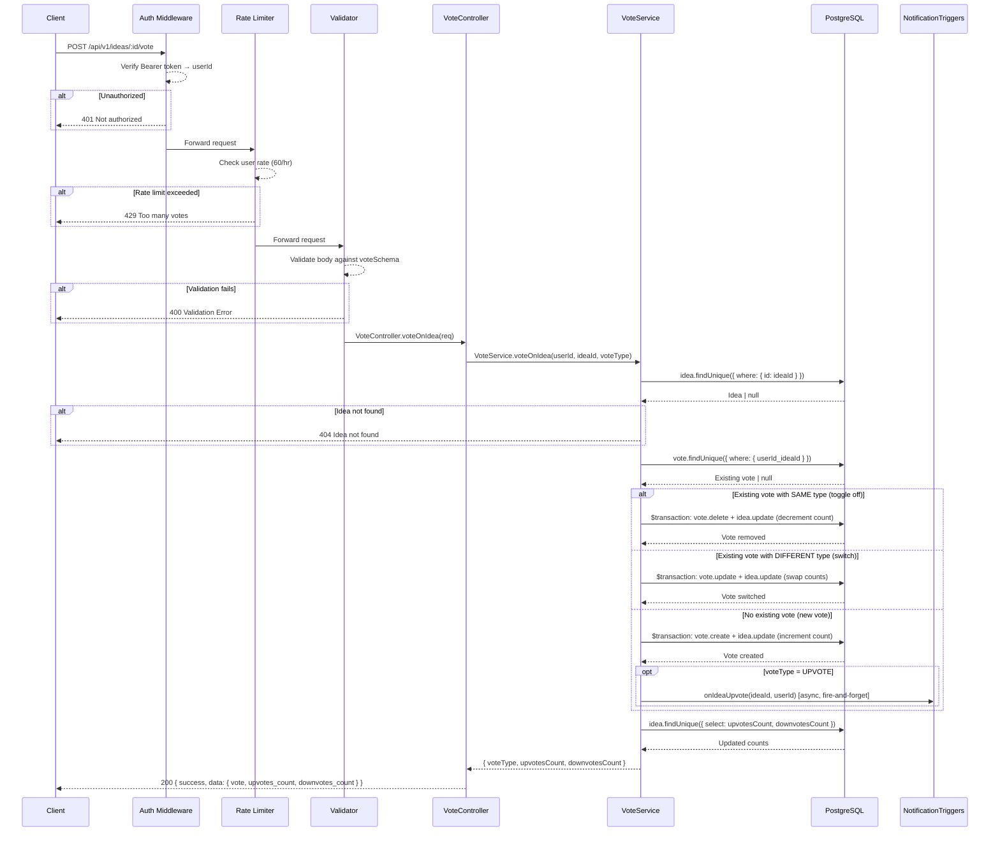

# Voting API

Base path: `/api/v1`

---

## POST `/api/v1/ideas/:id/vote`

**Vote on Idea (Upvote / Downvote with Toggle)**

| Property   | Value                                     |
| ---------- | ----------------------------------------- |
| Auth       | `protect` — Bearer token required          |
| Rate Limit | `voteLimiter` — 60 req / hr per user      |
| Validator  | `voteSchema`                              |

### Flow Diagram



### Request

**Headers**

| Header        | Value            | Required |
| ------------- | ---------------- | -------- |
| Authorization | Bearer `<token>` | Yes      |
| Content-Type  | application/json | Yes      |

**Path Parameters**

| Param | Type | Description |
| ----- | ---- | ----------- |
| id    | uuid | Idea ID     |

**Body**

| Field     | Type | Constraints                    | Required |
| --------- | ---- | ------------------------------ | -------- |
| vote_type | enum | `"upvote"` \| `"downvote"` | Yes      |

### Response

**200 OK**

```json
{
  "success": true,
  "data": {
    "vote": {
      "vote_type": "upvote | downvote | null"
    },
    "upvotes_count": 10,
    "downvotes_count": 2
  }
}
```

- `vote.vote_type` is `null` when the vote was toggled off (removed).

**404 Not Found**

```json
{
  "success": false,
  "error": "Idea not found"
}
```

### Notes

- **Toggle behavior**: Voting the same type again removes the vote. Voting a different type switches the vote.
- All vote + count updates are wrapped in a database transaction for consistency.
- Upvote notifications are triggered only for *new* upvotes (not switches or toggles).
- The `upvotes_count` and `downvotes_count` on the `Idea` model are denormalized counters maintained by transactions.

### Frontend Usage

| Component | Path |
| --------- | ---- |
| VoteButtons | `frontend/components/VoteButtons.tsx` — votes via `votesApi.voteOnIdea()` |
