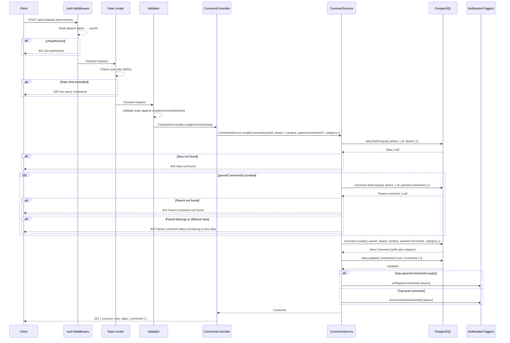
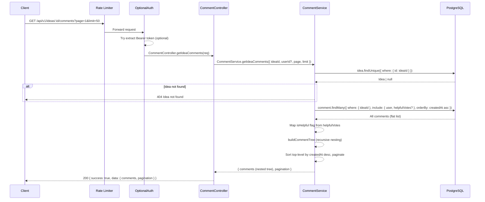
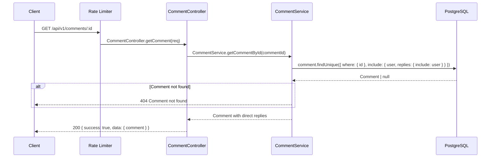
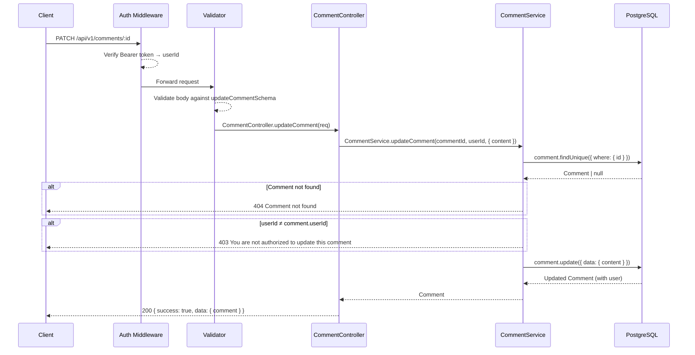
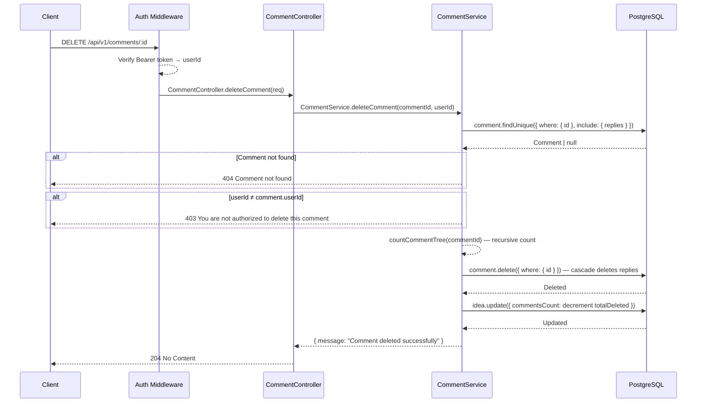
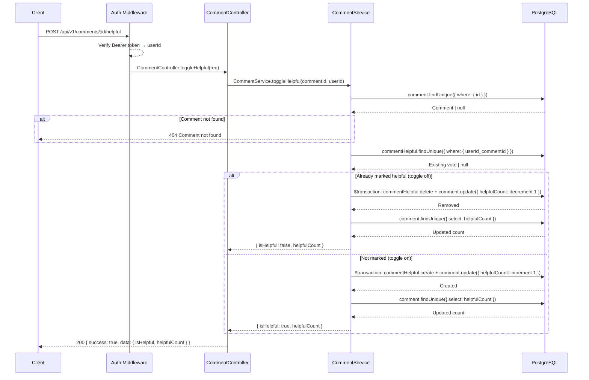

# Comments API

Base path: `/api/v1`

---

## POST `/api/v1/ideas/:id/comments`

**Create Comment or Reply**

| Property   | Value                                        |
| ---------- | -------------------------------------------- |
| Auth       | `protect` — Bearer token required             |
| Rate Limit | `commentLimiter` — 30 req / hr per user      |
| Validator  | `createCommentSchema`                        |

### Flow Diagram



### Request

**Headers**

| Header        | Value            | Required |
| ------------- | ---------------- | -------- |
| Authorization | Bearer `<token>` | Yes      |
| Content-Type  | application/json | Yes      |

**Path Parameters**

| Param | Type | Description |
| ----- | ---- | ----------- |
| id    | uuid | Idea ID     |

**Body**

| Field           | Type   | Constraints                                                                                                                  | Required |
| --------------- | ------ | ---------------------------------------------------------------------------------------------------------------------------- | -------- |
| content         | string | min 1 character                                                                                                              | Yes      |
| parentCommentId | uuid   | Must reference an existing comment on the same idea                                                                          | No       |
| category        | enum   | `"PROBLEM_CLARITY"` \| `"TARGET_USERS"` \| `"WILLINGNESS_TO_PAY"` \| `"TECHNICAL_FEASIBILITY"` \| `"FEATURE_SUGGESTION"` \| `"GENERAL"` | No (default: `GENERAL`) |

### Response

**201 Created**

```json
{
  "success": true,
  "data": {
    "comment": {
      "id": "uuid",
      "content": "string",
      "userId": "uuid",
      "ideaId": "uuid",
      "parentCommentId": "uuid | null",
      "category": "GENERAL",
      "helpfulCount": 0,
      "createdAt": "ISO 8601",
      "updatedAt": "ISO 8601",
      "user": {
        "id": "uuid",
        "username": "string",
        "profilePicture": "string | null"
      }
    }
  }
}
```

### Notes

- Top-level comments: omit `parentCommentId`.
- Replies: include `parentCommentId`. The parent must belong to the same idea.
- The idea's `commentsCount` is incremented by 1.
- Notifications are triggered asynchronously (fire-and-forget).

### Frontend Usage

| Component | Path |
| --------- | ---- |
| CommentSection | `frontend/components/CommentSection.tsx` — creates comments via `commentsApi.createComment()` |

---

## GET `/api/v1/ideas/:id/comments`

**Get Comments for Idea**

| Property   | Value                                                    |
| ---------- | -------------------------------------------------------- |
| Auth       | `optionalProtect` — includes `isHelpful` per comment if authed |
| Rate Limit | `generalLimiter` — 100 req / min per IP (GET)            |

### Flow Diagram



### Request

**Path Parameters**

| Param | Type | Description |
| ----- | ---- | ----------- |
| id    | uuid | Idea ID     |

**Query Parameters**

| Param | Type   | Default | Description              |
| ----- | ------ | ------- | ------------------------ |
| page  | number | 1       | Page of top-level comments |
| limit | number | 50      | Top-level comments per page |

### Response

**200 OK**

```json
{
  "success": true,
  "data": {
    "comments": [
      {
        "id": "uuid",
        "content": "string",
        "userId": "uuid",
        "ideaId": "uuid",
        "parentCommentId": null,
        "category": "GENERAL",
        "helpfulCount": 3,
        "isHelpful": false,
        "createdAt": "ISO 8601",
        "updatedAt": "ISO 8601",
        "user": {
          "id": "uuid",
          "username": "string",
          "profilePicture": "string | null"
        },
        "replies": [
          {
            "id": "uuid",
            "content": "string",
            "parentCommentId": "parent-uuid",
            "replies": []
          }
        ]
      }
    ],
    "pagination": {
      "page": 1,
      "limit": 50,
      "total": 12,
      "totalPages": 1
    }
  }
}
```

### Notes

- Comments are returned as a nested tree structure with recursive `replies`.
- Pagination applies only to top-level comments; all replies to paginated comments are included.
- `isHelpful` is included only when the user is authenticated.

### Frontend Usage

| Component | Path |
| --------- | ---- |
| CommentSection | `frontend/components/CommentSection.tsx` — fetches comments via `commentsApi.getIdeaComments()` |

---

## GET `/api/v1/comments/:id`

**Get Single Comment**

| Property   | Value                                    |
| ---------- | ---------------------------------------- |
| Auth       | None                                      |
| Rate Limit | `generalLimiter` — 100 req / min per IP  |

### Flow Diagram



### Request

**Path Parameters**

| Param | Type | Description |
| ----- | ---- | ----------- |
| id    | uuid | Comment ID  |

### Response

**200 OK**

```json
{
  "success": true,
  "data": {
    "comment": {
      "id": "uuid",
      "content": "string",
      "userId": "uuid",
      "ideaId": "uuid",
      "parentCommentId": "uuid | null",
      "category": "GENERAL",
      "helpfulCount": 0,
      "createdAt": "ISO 8601",
      "updatedAt": "ISO 8601",
      "user": {
        "id": "uuid",
        "username": "string",
        "profilePicture": "string | null"
      },
      "replies": [
        {
          "id": "uuid",
          "content": "string",
          "user": { "id": "uuid", "username": "string", "profilePicture": "string | null" }
        }
      ]
    }
  }
}
```

### Notes

- Returns only direct replies (one level deep), not a fully nested tree.
- Replies are sorted by `createdAt` ascending (oldest first).

### Frontend Usage

| Component | Path |
| --------- | ---- |
| — | Not currently used by any frontend component. |

---

## PATCH `/api/v1/comments/:id`

**Update Comment**

| Property  | Value                            |
| --------- | -------------------------------- |
| Auth      | `protect` — Bearer token required |
| Validator | `updateCommentSchema`            |

### Flow Diagram



### Request

**Path Parameters**

| Param | Type | Description |
| ----- | ---- | ----------- |
| id    | uuid | Comment ID  |

**Body**

| Field   | Type   | Constraints     | Required |
| ------- | ------ | --------------- | -------- |
| content | string | min 1 character | Yes      |

### Response

**200 OK** — Returns the updated comment (same shape as Create Comment response).

### Frontend Usage

| Component | Path |
| --------- | ---- |
| CommentSection | `frontend/components/CommentSection.tsx` — updates comments via `commentsApi.updateComment()` |

---

## DELETE `/api/v1/comments/:id`

**Delete Comment**

| Property | Value                            |
| -------- | -------------------------------- |
| Auth     | `protect` — Bearer token required |

### Flow Diagram



### Request

**Path Parameters**

| Param | Type | Description |
| ----- | ---- | ----------- |
| id    | uuid | Comment ID  |

### Response

**204 No Content** — Comment and all nested replies deleted.

### Notes

- Cascade deletes all nested replies.
- The idea's `commentsCount` is decremented by the total number of deleted comments (parent + all nested replies).

### Frontend Usage

| Component | Path |
| --------- | ---- |
| CommentSection | `frontend/components/CommentSection.tsx` — deletes comments via `commentsApi.deleteComment()` |

---

## POST `/api/v1/comments/:id/helpful`

**Toggle Helpful on Comment**

| Property | Value                            |
| -------- | -------------------------------- |
| Auth     | `protect` — Bearer token required |

### Flow Diagram



### Request

**Path Parameters**

| Param | Type | Description |
| ----- | ---- | ----------- |
| id    | uuid | Comment ID  |

### Response

**200 OK**

```json
{
  "success": true,
  "data": {
    "isHelpful": true,
    "helpfulCount": 5
  }
}
```

### Notes

- Toggle behavior: calling again removes the helpful vote.
- The `helpfulCount` on the comment is a denormalized counter maintained via transactions.
- Each user can mark a comment as helpful only once (unique constraint on `userId + commentId`).

### Frontend Usage

| Component | Path |
| --------- | ---- |
| CommentItem | `frontend/components/CommentItem.tsx` — toggles helpful via `commentsApi.toggleHelpful()` |
