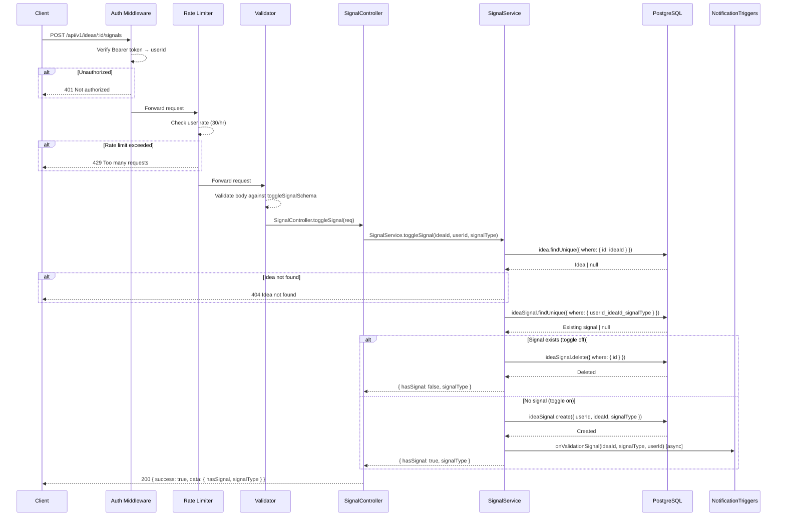
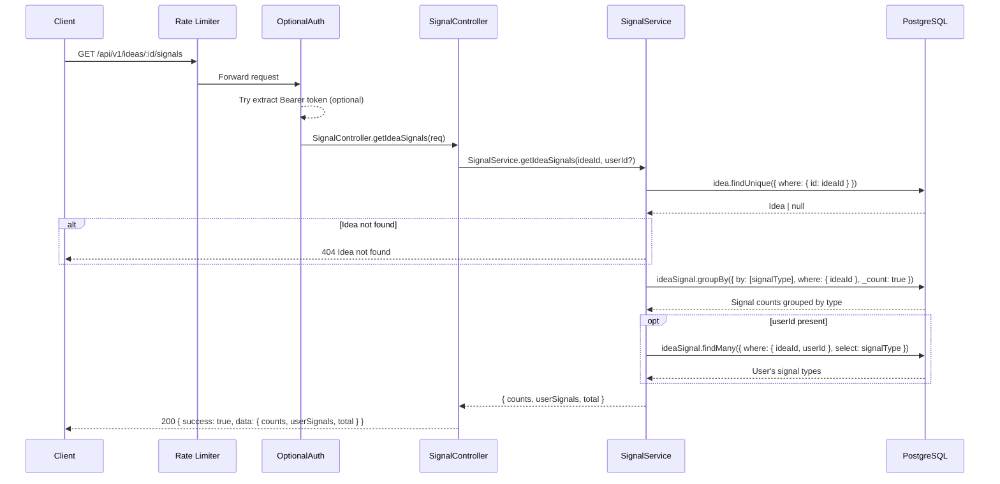

# Validation Signals API

Base path: `/api/v1`

---

## POST `/api/v1/ideas/:id/signals`

**Toggle Validation Signal**

| Property   | Value                                     |
| ---------- | ----------------------------------------- |
| Auth       | `protect` — Bearer token required          |
| Rate Limit | `commentLimiter` — 30 req / hr per user   |
| Validator  | `toggleSignalSchema`                      |

### Flow Diagram



### Request

**Headers**

| Header        | Value            | Required |
| ------------- | ---------------- | -------- |
| Authorization | Bearer `<token>` | Yes      |
| Content-Type  | application/json | Yes      |

**Path Parameters**

| Param | Type | Description |
| ----- | ---- | ----------- |
| id    | uuid | Idea ID     |

**Body**

| Field      | Type | Constraints                                                              | Required |
| ---------- | ---- | ------------------------------------------------------------------------ | -------- |
| signalType | enum | `"PROBLEM_REAL"` \| `"WOULD_PAY"` \| `"READY_TO_BUILD"` \| `"NEEDS_CLARITY"` | Yes      |

### Response

**200 OK**

```json
{
  "success": true,
  "data": {
    "hasSignal": true,
    "signalType": "PROBLEM_REAL"
  }
}
```

**404 Not Found**

```json
{
  "success": false,
  "error": "Idea not found"
}
```

### Notes

- **Toggle behavior**: If the user already gave the same signal type on the same idea, it is removed. Otherwise, it is added.
- A user can have multiple *different* signal types on the same idea (e.g., both `PROBLEM_REAL` and `WOULD_PAY`), but only one of each type (unique constraint on `userId + ideaId + signalType`).
- Notifications are triggered only when a signal is added (not removed).

### Frontend Usage

| Component | Path |
| --------- | ---- |
| ValidationSignals | `frontend/components/ValidationSignals.tsx` — toggles signals via `signalsApi.toggleSignal()` |

---

## GET `/api/v1/ideas/:id/signals`

**Get Signals for Idea**

| Property   | Value                                                   |
| ---------- | ------------------------------------------------------- |
| Auth       | `optionalProtect` — includes user signals if authed      |
| Rate Limit | `generalLimiter` — 100 req / min per IP (GET)           |

### Flow Diagram



### Request

**Path Parameters**

| Param | Type | Description |
| ----- | ---- | ----------- |
| id    | uuid | Idea ID     |

### Response

**200 OK**

```json
{
  "success": true,
  "data": {
    "counts": {
      "PROBLEM_REAL": 5,
      "WOULD_PAY": 3,
      "READY_TO_BUILD": 2,
      "NEEDS_CLARITY": 1
    },
    "userSignals": ["PROBLEM_REAL", "WOULD_PAY"],
    "total": 11
  }
}
```

- `userSignals` is an empty array for unauthenticated requests.

### Notes

- Signal counts are aggregated using `groupBy` on `signalType`.
- The `total` field is the sum of all signal counts across all types.

### Frontend Usage

| Component | Path |
| --------- | ---- |
| ValidationSignals | `frontend/components/ValidationSignals.tsx` — fetches signals via `signalsApi.getIdeaSignals()` |
