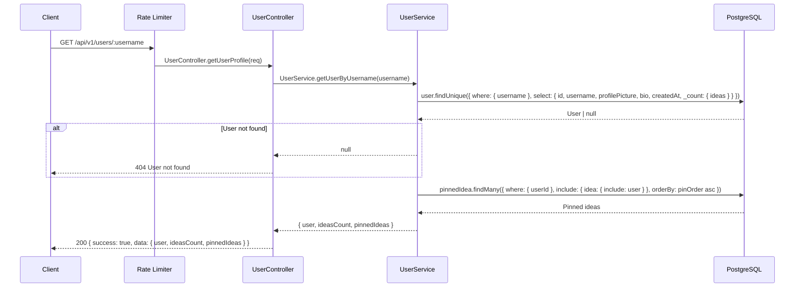
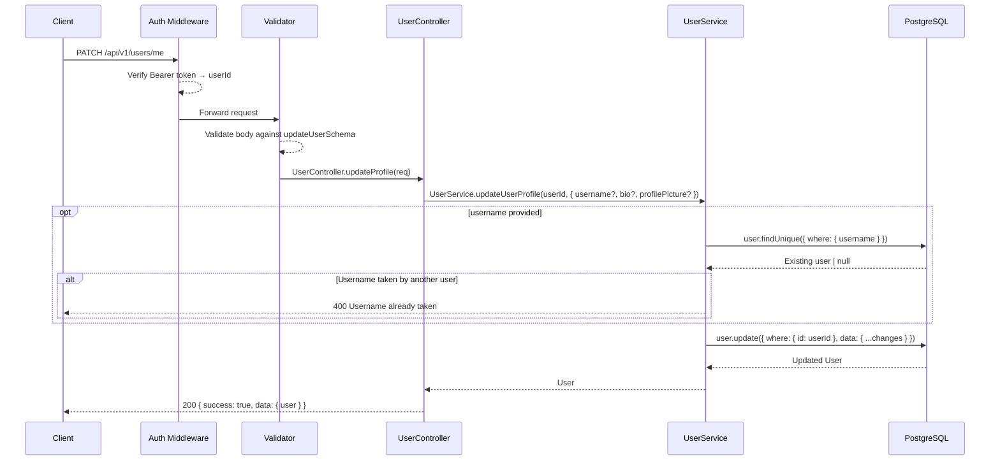
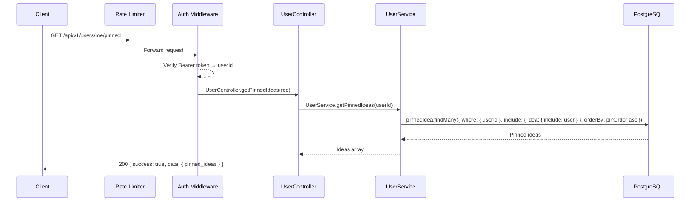
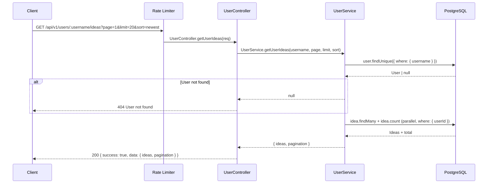
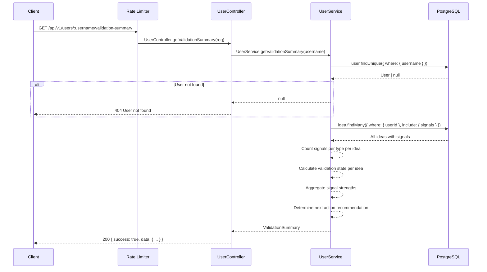
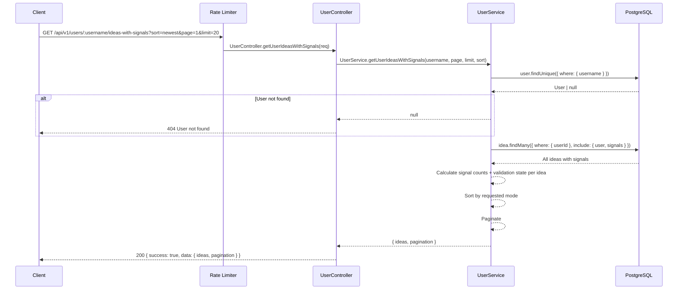
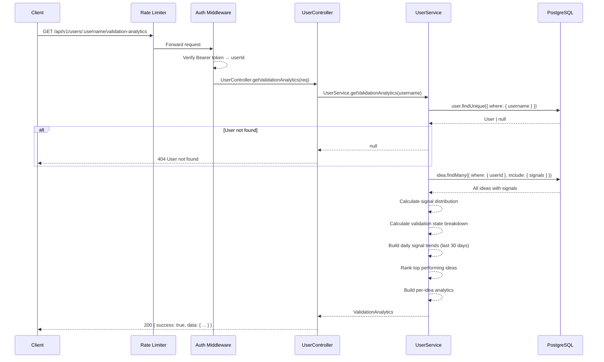

# Users API

Base path: `/api/v1/users`

---

## GET `/api/v1/users/:username`

**Get User Profile**

| Property   | Value                                    |
| ---------- | ---------------------------------------- |
| Auth       | None                                      |
| Rate Limit | `generalLimiter` — 100 req / min per IP  |

### Flow Diagram



### Request

**Path Parameters**

| Param    | Type   | Description |
| -------- | ------ | ----------- |
| username | string | Username    |

### Response

**200 OK**

```json
{
  "success": true,
  "data": {
    "user": {
      "id": "uuid",
      "username": "string",
      "profilePicture": "string | null",
      "bio": "string | null",
      "createdAt": "ISO 8601"
    },
    "ideasCount": 12,
    "pinnedIdeas": [
      {
        "id": "uuid",
        "heading": "string",
        "description": "string",
        "status": "DRAFT",
        "upvotesCount": 10,
        "user": { "username": "string", "profilePicture": "string | null" }
      }
    ]
  }
}
```

### Frontend Usage

| Component | Path |
| --------- | ---- |
| Profile Page | `frontend/app/(app)/[username]/page.tsx` — fetches profile via `userApi.getUserProfile()` |

---

## PATCH `/api/v1/users/me`

**Update Profile**

| Property  | Value                            |
| --------- | -------------------------------- |
| Auth      | `protect` — Bearer token required |
| Validator | `updateUserSchema`               |

### Flow Diagram



### Request

**Headers**

| Header        | Value            | Required |
| ------------- | ---------------- | -------- |
| Authorization | Bearer `<token>` | Yes      |
| Content-Type  | application/json | Yes      |

**Body** (all fields optional)

| Field          | Type   | Constraints                           |
| -------------- | ------ | ------------------------------------- |
| username       | string | 3–50 chars, alphanumeric + underscore |
| bio            | string | max 500 characters                    |
| profilePicture | string | Valid URL                             |

### Response

**200 OK**

```json
{
  "success": true,
  "data": {
    "user": {
      "id": "uuid",
      "username": "string",
      "email": "string",
      "profilePicture": "string | null",
      "bio": "string | null",
      "createdAt": "ISO 8601",
      "updatedAt": "ISO 8601"
    }
  }
}
```

**400 Bad Request**

```json
{
  "success": false,
  "error": "Username already taken"
}
```

### Frontend Usage

| Component | Path |
| --------- | ---- |
| Edit Profile Page | `frontend/app/(app)/[username]/edit/page.tsx` — updates profile via `userApi.updateProfile()` |

---

## GET `/api/v1/users/me/pinned`

**Get My Pinned Ideas**

| Property   | Value                                    |
| ---------- | ---------------------------------------- |
| Auth       | `protect` — Bearer token required         |
| Rate Limit | `generalLimiter` — 100 req / min per IP  |

### Flow Diagram



### Response

**200 OK**

```json
{
  "success": true,
  "data": {
    "pinned_ideas": [
      {
        "id": "uuid",
        "heading": "string",
        "description": "string",
        "status": "DRAFT",
        "upvotesCount": 10,
        "user": { "username": "string", "profilePicture": "string | null" }
      }
    ]
  }
}
```

### Frontend Usage

| Component | Path |
| --------- | ---- |
| PinButton | `frontend/components/PinButton.tsx` — fetches pinned ideas via `userApi.getPinnedIdeas()` |

---

## GET `/api/v1/users/:username/ideas`

**Get User Ideas**

| Property   | Value                                    |
| ---------- | ---------------------------------------- |
| Auth       | None                                      |
| Rate Limit | `generalLimiter` — 100 req / min per IP  |

### Flow Diagram



### Request

**Path Parameters**

| Param    | Type   | Description |
| -------- | ------ | ----------- |
| username | string | Username    |

**Query Parameters**

| Param | Type   | Constraints                              | Default  |
| ----- | ------ | ---------------------------------------- | -------- |
| page  | number | ≥ 1                                      | 1        |
| limit | number | ≥ 1                                      | 20       |
| sort  | string | `"newest"` \| `"oldest"` \| `"popular"` | `newest` |

### Response

**200 OK**

```json
{
  "success": true,
  "data": {
    "ideas": [
      {
        "id": "uuid",
        "heading": "string",
        "description": "string",
        "status": "DRAFT",
        "upvotesCount": 10,
        "downvotesCount": 2,
        "commentsCount": 5,
        "createdAt": "ISO 8601",
        "user": { "username": "string", "profilePicture": "string | null" }
      }
    ],
    "pagination": {
      "page": 1,
      "limit": 20,
      "total": 50,
      "total_pages": 3
    }
  }
}
```

### Frontend Usage

| Component | Path |
| --------- | ---- |
| Profile Page | `frontend/app/(app)/[username]/page.tsx` — fetches user ideas via `userApi.getUserIdeas()` |

---

## GET `/api/v1/users/:username/validation-summary`

**Get Validation Summary**

| Property   | Value                                    |
| ---------- | ---------------------------------------- |
| Auth       | None                                      |
| Rate Limit | `generalLimiter` — 100 req / min per IP  |

### Flow Diagram



### Response

**200 OK**

```json
{
  "success": true,
  "data": {
    "totalIdeas": 5,
    "problem": {
      "signalType": "PROBLEM_REAL",
      "totalCount": 12,
      "ideasWithSignal": 3,
      "strength": "STRONG | MIXED | WEAK | EARLY | NONE"
    },
    "willingness": {
      "signalType": "WOULD_PAY",
      "totalCount": 8,
      "ideasWithSignal": 2,
      "strength": "MIXED"
    },
    "execution": {
      "signalType": "READY_TO_BUILD",
      "totalCount": 4,
      "ideasWithSignal": 2,
      "strength": "WEAK"
    },
    "clarity": {
      "signalType": "NEEDS_CLARITY",
      "totalCount": 2,
      "ideasWithSignal": 1,
      "strength": "EARLY"
    },
    "nextAction": {
      "action": "CLARIFY_PROBLEM | TEST_PRICING | READY_TO_BUILD | GATHER_FEEDBACK | ADD_FIRST_IDEA",
      "message": "Human-readable recommendation",
      "priority": "HIGH | MEDIUM | LOW",
      "targetIdeaId": "uuid (optional)",
      "targetIdeaHeading": "string (optional)"
    },
    "ideasByValidationState": {
      "needsAction": 1,
      "readyToBuild": 2,
      "validated": 1
    }
  }
}
```

### Notes

- **Signal Strength** is calculated based on the ratio of ideas with a given signal to total ideas, requiring minimum 5 signals before meaningful calculation.
  - `STRONG` ≥ 60%, `MIXED` ≥ 30%, `WEAK` > 0%, `EARLY` < 5 total signals, `NONE` = 0.
- **Validation State** per idea: `VALIDATED`, `READY_TO_BUILD`, `NEEDS_ACTION`, or `NEUTRAL`.
- **Next Action** recommends the most impactful next step based on signal patterns.

### Frontend Usage

| Component | Path |
| --------- | ---- |
| Profile Page | `frontend/app/(app)/[username]/page.tsx` — fetches validation summary via `userApi.getValidationSummary()` |

---

## GET `/api/v1/users/:username/ideas-with-signals`

**Get User Ideas with Signal Snapshots**

| Property   | Value                                    |
| ---------- | ---------------------------------------- |
| Auth       | None                                      |
| Rate Limit | `generalLimiter` — 100 req / min per IP  |

### Flow Diagram



### Request

**Query Parameters**

| Param | Type   | Constraints                                                                  | Default  |
| ----- | ------ | ---------------------------------------------------------------------------- | -------- |
| page  | number | ≥ 1                                                                          | 1        |
| limit | number | ≥ 1                                                                          | 20       |
| sort  | string | `"needs_action"` \| `"ready_to_build"` \| `"newest"` \| `"oldest"` \| `"all"` | `newest` |

### Response

**200 OK**

```json
{
  "success": true,
  "data": {
    "ideas": [
      {
        "id": "uuid",
        "userId": "uuid",
        "heading": "string",
        "description": "string",
        "status": "DRAFT",
        "launchedLink": "string | null",
        "commentsCount": 5,
        "createdAt": "ISO 8601",
        "updatedAt": "ISO 8601",
        "user": { "username": "string", "profilePicture": "string | null" },
        "signals": {
          "problemReal": 3,
          "wouldPay": 2,
          "readyToBuild": 1,
          "needsClarity": 0
        },
        "validationState": "NEEDS_ACTION | READY_TO_BUILD | VALIDATED | NEUTRAL"
      }
    ],
    "pagination": {
      "page": 1,
      "limit": 20,
      "total": 5,
      "total_pages": 1
    }
  }
}
```

### Notes

- `needs_action` filter returns only ideas with `NEEDS_ACTION` or `NEUTRAL` state, sorted by urgency.
- `ready_to_build` filter returns only ideas with `READY_TO_BUILD` or `VALIDATED` state, sorted by signal strength.

### Frontend Usage

| Component | Path |
| --------- | ---- |
| Profile Page | `frontend/app/(app)/[username]/page.tsx` — fetches ideas with signals via `userApi.getUserIdeasWithSignals()` |

---

## GET `/api/v1/users/:username/validation-analytics`

**Get Validation Analytics**

| Property   | Value                                    |
| ---------- | ---------------------------------------- |
| Auth       | `protect` — Bearer token required         |
| Rate Limit | `generalLimiter` — 100 req / min per IP  |

### Flow Diagram



### Response

**200 OK**

```json
{
  "success": true,
  "data": {
    "signalDistribution": [
      { "type": "PROBLEM_REAL", "count": 15, "percentage": 40.5 },
      { "type": "WOULD_PAY", "count": 10, "percentage": 27.0 },
      { "type": "READY_TO_BUILD", "count": 8, "percentage": 21.6 },
      { "type": "NEEDS_CLARITY", "count": 4, "percentage": 10.8 }
    ],
    "validationStateBreakdown": [
      { "state": "Needs Action", "count": 2 },
      { "state": "Ready to Build", "count": 1 },
      { "state": "Validated", "count": 1 },
      { "state": "Neutral", "count": 3 }
    ],
    "dailyTrends": [
      { "date": "2026-01-16", "problemReal": 1, "wouldPay": 0, "readyToBuild": 0, "needsClarity": 0 }
    ],
    "topIdeas": [
      { "id": "uuid", "heading": "string", "totalSignals": 12 }
    ],
    "totals": {
      "totalSignals": 37,
      "totalIdeas": 7,
      "avgSignalsPerIdea": 5.28
    },
    "perIdeaAnalytics": [
      {
        "id": "uuid",
        "heading": "string",
        "signalDistribution": [
          { "type": "PROBLEM_REAL", "count": 5, "percentage": 50.0 }
        ],
        "dailyTrends": [],
        "totals": { "totalSignals": 10 },
        "validationState": "VALIDATED"
      }
    ]
  }
}
```

### Notes

- Requires authentication (owner-only analytics).
- Daily trends cover the last 30 days with zero-filled entries for days without signals.
- Top ideas are ranked by total signal count (max 5 returned).
- Per-idea analytics include individual signal distributions, trends, and validation states.

### Frontend Usage

| Component | Path |
| --------- | ---- |
| Profile Page | `frontend/app/(app)/[username]/page.tsx` — fetches analytics via `userApi.getValidationAnalytics()` |
