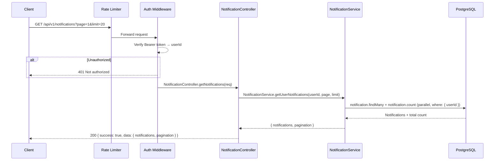
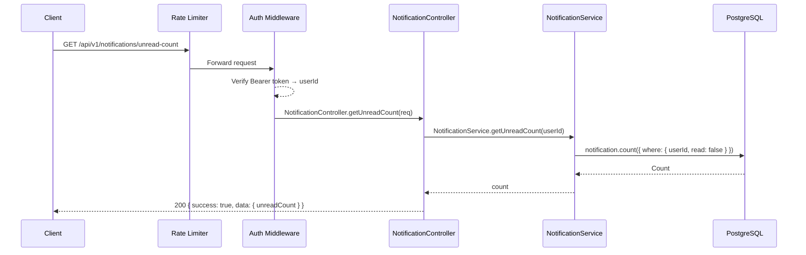
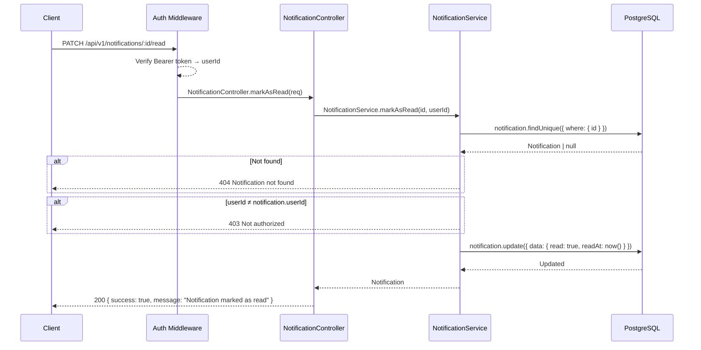
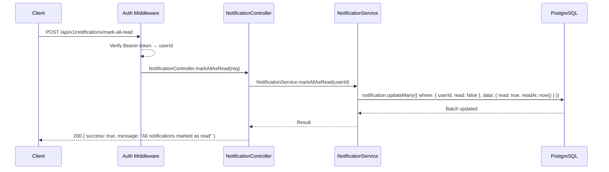
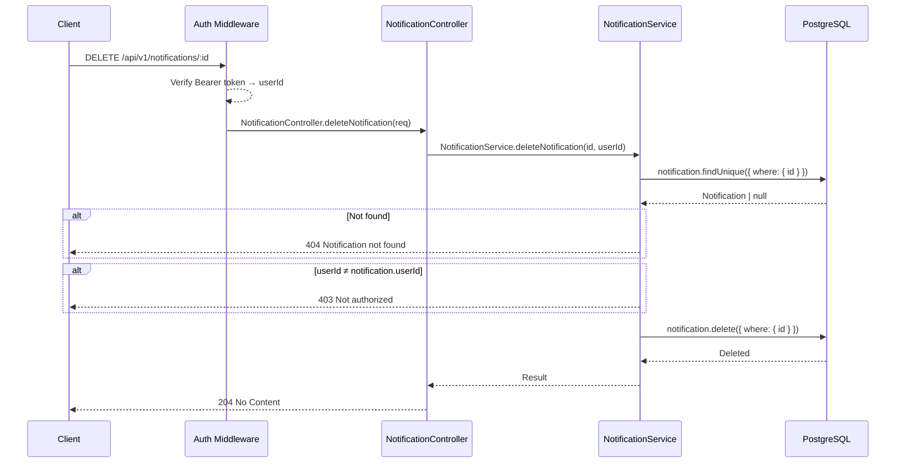
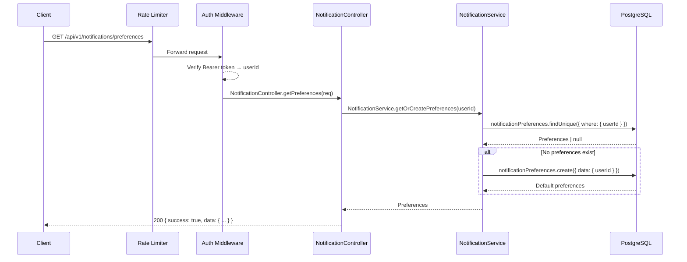
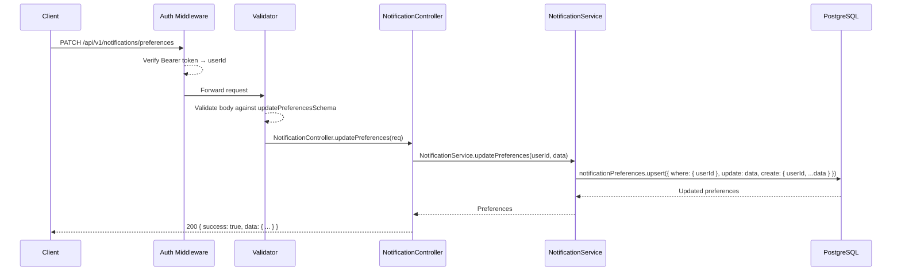

# Notifications API

Base path: `/api/v1/notifications`

All routes require authentication (`router.use(protect)`).

---

## GET `/api/v1/notifications`

**Get Notifications**

| Property   | Value                                    |
| ---------- | ---------------------------------------- |
| Auth       | `protect` — Bearer token required         |
| Rate Limit | `generalLimiter` — 100 req / min per IP  |

### Flow Diagram



### Request

**Query Parameters**

| Param | Type   | Default | Description             |
| ----- | ------ | ------- | ----------------------- |
| page  | number | 1       | Page number             |
| limit | number | 20      | Notifications per page  |

### Response

**200 OK**

```json
{
  "success": true,
  "data": {
    "notifications": [
      {
        "id": "uuid",
        "userId": "uuid",
        "type": "UPVOTE | SIGNAL | COMMENT | REPLY | MILESTONE",
        "priority": "LOW | MEDIUM | HIGH",
        "title": "string",
        "message": "string",
        "actionUrl": "string | null",
        "ideaId": "uuid | null",
        "commentId": "uuid | null",
        "triggeredById": "uuid | null",
        "read": false,
        "readAt": "ISO 8601 | null",
        "createdAt": "ISO 8601",
        "triggeredBy": {
          "id": "uuid",
          "username": "string",
          "profilePicture": "string | null"
        },
        "idea": {
          "id": "uuid",
          "heading": "string"
        }
      }
    ],
    "pagination": {
      "page": 1,
      "limit": 20,
      "total": 45,
      "totalPages": 3
    }
  }
}
```

### Notes

- Notifications are sorted by `createdAt` descending (newest first).
- Includes related `triggeredBy` user and `idea` data for context.

### Frontend Usage

| Component | Path |
| --------- | ---- |
| NotificationBell | `frontend/components/NotificationBell.tsx` — fetches notifications via `getNotifications()` |
| NotificationsList | `frontend/components/NotificationsList.tsx` — fetches notifications via `getNotifications()` |

---

## GET `/api/v1/notifications/unread-count`

**Get Unread Count**

| Property   | Value                                    |
| ---------- | ---------------------------------------- |
| Auth       | `protect` — Bearer token required         |
| Rate Limit | `generalLimiter` — 100 req / min per IP  |

### Flow Diagram



### Response

**200 OK**

```json
{
  "success": true,
  "data": {
    "unreadCount": 7
  }
}
```

### Frontend Usage

| Component | Path |
| --------- | ---- |
| NotificationBell | `frontend/components/NotificationBell.tsx` — fetches unread count via `getUnreadCount()` |
| useNotificationCount | `frontend/hooks/useNotificationCount.ts` — polls unread count every 30s via `getUnreadCount()` |
| AppSidebar | `frontend/components/app-shell/AppSidebar.tsx` — displays count via `useNotificationCount()` hook |
| MobileBottomNav | `frontend/components/app-shell/MobileBottomNav.tsx` — displays count via `useNotificationCount()` hook |

---

## PATCH `/api/v1/notifications/:id/read`

**Mark Notification as Read**

| Property | Value                            |
| -------- | -------------------------------- |
| Auth     | `protect` — Bearer token required |

### Flow Diagram



### Request

**Path Parameters**

| Param | Type | Description     |
| ----- | ---- | --------------- |
| id    | uuid | Notification ID |

### Response

**200 OK**

```json
{
  "success": true,
  "message": "Notification marked as read"
}
```

### Frontend Usage

| Component | Path |
| --------- | ---- |
| NotificationBell | `frontend/components/NotificationBell.tsx` — marks as read via `markAsRead()` |
| NotificationsList | `frontend/components/NotificationsList.tsx` — marks as read via `markAsRead()` |

---

## POST `/api/v1/notifications/mark-all-read`

**Mark All Notifications as Read**

| Property | Value                            |
| -------- | -------------------------------- |
| Auth     | `protect` — Bearer token required |

### Flow Diagram



### Response

**200 OK**

```json
{
  "success": true,
  "message": "All notifications marked as read"
}
```

### Frontend Usage

| Component | Path |
| --------- | ---- |
| NotificationBell | `frontend/components/NotificationBell.tsx` — marks all as read via `markAllAsRead()` |
| NotificationsList | `frontend/components/NotificationsList.tsx` — marks all as read via `markAllAsRead()` |

---

## DELETE `/api/v1/notifications/:id`

**Delete Notification**

| Property | Value                            |
| -------- | -------------------------------- |
| Auth     | `protect` — Bearer token required |

### Flow Diagram



### Request

**Path Parameters**

| Param | Type | Description     |
| ----- | ---- | --------------- |
| id    | uuid | Notification ID |

### Response

**204 No Content** — Notification deleted.

### Frontend Usage

| Component | Path |
| --------- | ---- |
| NotificationsList | `frontend/components/NotificationsList.tsx` — deletes notifications via `deleteNotification()` |

---

## GET `/api/v1/notifications/preferences`

**Get Notification Preferences**

| Property   | Value                                    |
| ---------- | ---------------------------------------- |
| Auth       | `protect` — Bearer token required         |
| Rate Limit | `generalLimiter` — 100 req / min per IP  |

### Flow Diagram



### Response

**200 OK**

```json
{
  "success": true,
  "data": {
    "id": "uuid",
    "userId": "uuid",
    "emailFirstFeedback": true,
    "emailDailySummary": true,
    "emailSignals": true,
    "emailComments": true,
    "emailReplies": true,
    "emailMilestones": true,
    "inAppUpVotes": true,
    "inAppUpSignals": true,
    "inAppUpComments": true,
    "inAppUpReplies": true,
    "createdAt": "ISO 8601",
    "updatedAt": "ISO 8601"
  }
}
```

### Notes

- If no preferences exist for the user, default preferences are created automatically (all set to `true`).

### Frontend Usage

| Component | Path |
| --------- | ---- |
| NotificationSettingsDialog | `frontend/components/NotificationSettingsDialog.tsx` — fetches preferences via `getPreferences()` |
| NotificationSettingsPage | `frontend/components/NotificationSettingsPage.tsx` — fetches preferences via `getPreferences()` |

---

## PATCH `/api/v1/notifications/preferences`

**Update Notification Preferences**

| Property  | Value                            |
| --------- | -------------------------------- |
| Auth      | `protect` — Bearer token required |
| Validator | `updatePreferencesSchema`        |

### Flow Diagram



### Request

**Body** (all fields optional)

| Field              | Type    | Description                           |
| ------------------ | ------- | ------------------------------------- |
| emailFirstFeedback | boolean | Email on first feedback received      |
| emailDailySummary  | boolean | Daily summary email                   |
| emailSignals       | boolean | Email on new validation signals       |
| emailComments      | boolean | Email on new comments                 |
| emailReplies       | boolean | Email on new replies                  |
| emailMilestones    | boolean | Email on milestone achievements       |
| inAppUpVotes       | boolean | In-app notification for upvotes       |
| inAppUpSignals     | boolean | In-app notification for signals       |
| inAppUpComments    | boolean | In-app notification for comments      |
| inAppUpReplies     | boolean | In-app notification for replies       |

### Response

**200 OK** — Returns the full updated preferences object (same shape as Get Preferences response).

### Notes

- Uses `upsert` — creates default preferences if they don't exist, then applies updates.
- Only provided fields are updated; omitted fields retain their current values.

### Frontend Usage

| Component | Path |
| --------- | ---- |
| NotificationSettingsDialog | `frontend/components/NotificationSettingsDialog.tsx` — updates preferences via `updatePreferences()` |
| NotificationSettingsPage | `frontend/components/NotificationSettingsPage.tsx` — updates preferences via `updatePreferences()` |
