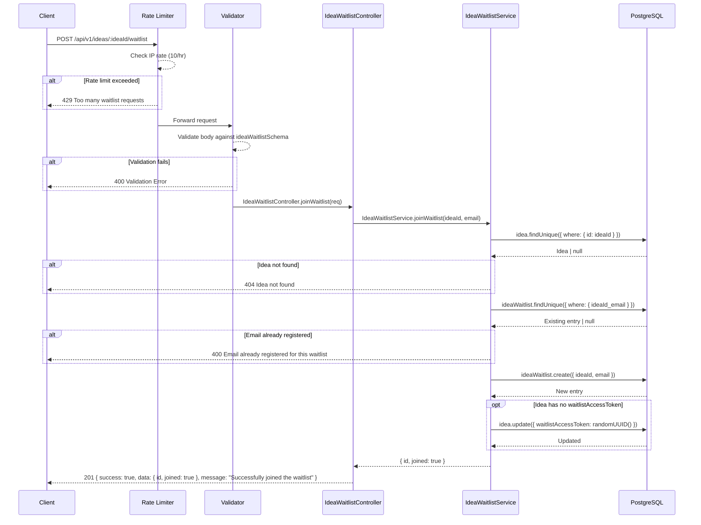
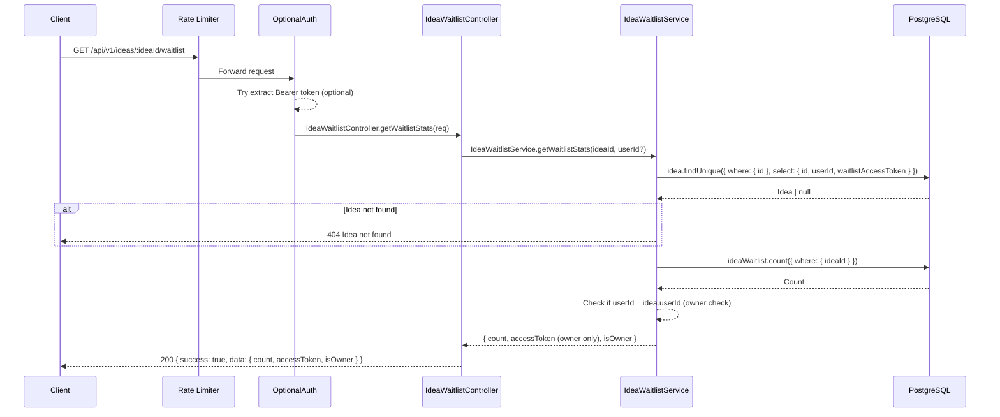
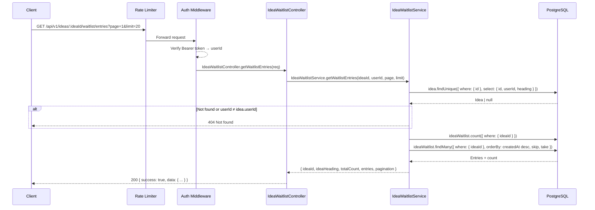
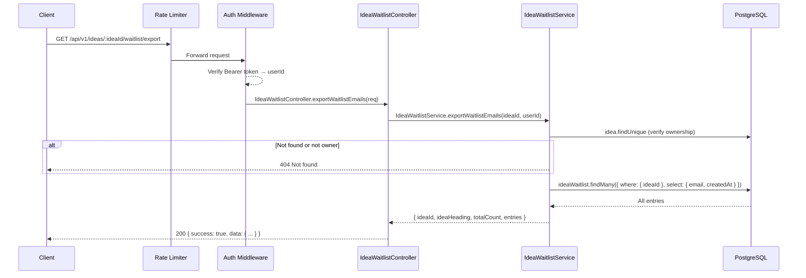
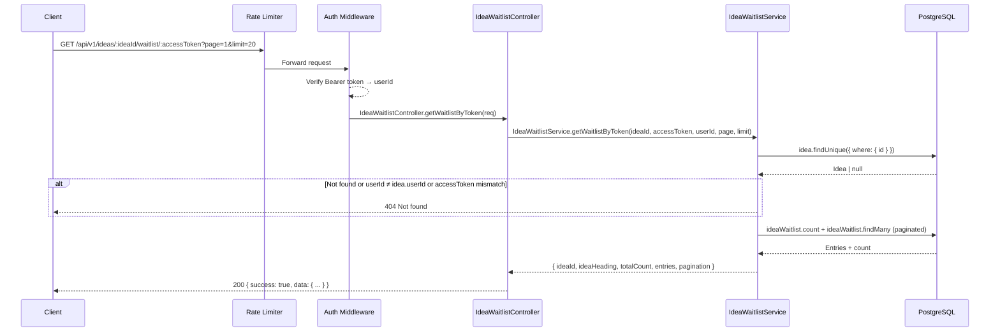
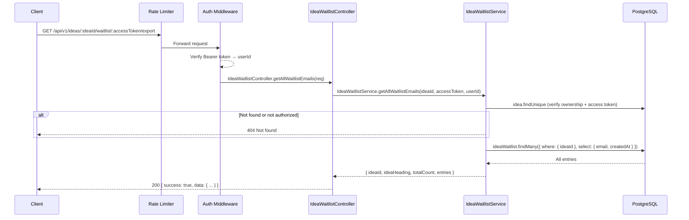

# Idea Waitlist API

Base path: `/api/v1`

---

## POST `/api/v1/ideas/:ideaId/waitlist`

**Join Idea Waitlist**

| Property   | Value                                            |
| ---------- | ------------------------------------------------ |
| Auth       | None (public endpoint)                            |
| Rate Limit | `ideaWaitlistLimiter` — 10 req / hr per IP       |
| Validator  | `ideaWaitlistSchema`                             |

### Flow Diagram



### Request

**Path Parameters**

| Param  | Type | Description |
| ------ | ---- | ----------- |
| ideaId | uuid | Idea ID     |

**Body**

| Field | Type   | Constraints        | Required |
| ----- | ------ | ------------------ | -------- |
| email | string | Valid email address | Yes      |

### Response

**201 Created**

```json
{
  "success": true,
  "data": {
    "id": "uuid",
    "joined": true
  },
  "message": "Successfully joined the waitlist"
}
```

**400 Bad Request**

```json
{
  "success": false,
  "error": "Email already registered for this waitlist"
}
```

### Notes

- Public endpoint — no authentication required.
- A `waitlistAccessToken` is auto-generated for the idea on first waitlist join (used for owner access).
- Unique constraint on `ideaId + email` prevents duplicate entries.

### Frontend Usage

| Component | Path |
| --------- | ---- |
| IdeaWaitlist | `frontend/components/IdeaWaitlist.tsx` — joins waitlist via `ideaWaitlistApi.joinWaitlist()` |

---

## GET `/api/v1/ideas/:ideaId/waitlist`

**Get Waitlist Stats**

| Property   | Value                                                 |
| ---------- | ----------------------------------------------------- |
| Auth       | `optionalProtect` — includes accessToken if owner      |
| Rate Limit | `generalLimiter` — 100 req / min per IP (GET)         |

### Flow Diagram



### Request

**Path Parameters**

| Param  | Type | Description |
| ------ | ---- | ----------- |
| ideaId | uuid | Idea ID     |

### Response

**200 OK**

```json
{
  "success": true,
  "data": {
    "count": 42,
    "accessToken": "uuid (only for owner, null otherwise)",
    "isOwner": true
  }
}
```

### Notes

- The `accessToken` is only returned to the idea owner (authenticated and matching `userId`).
- Non-owners and unauthenticated users see `accessToken: null`.

### Frontend Usage

| Component | Path |
| --------- | ---- |
| IdeaWaitlist | `frontend/components/IdeaWaitlist.tsx` — fetches waitlist stats via `ideaWaitlistApi.getWaitlistStats()` |

---

## GET `/api/v1/ideas/:ideaId/waitlist/entries`

**Get Waitlist Entries (Session Auth)**

| Property   | Value                                    |
| ---------- | ---------------------------------------- |
| Auth       | `protect` — Bearer token required (owner only) |
| Rate Limit | `generalLimiter` — 100 req / min per IP  |

### Flow Diagram



### Request

**Path Parameters**

| Param  | Type | Description |
| ------ | ---- | ----------- |
| ideaId | uuid | Idea ID     |

**Query Parameters**

| Param | Type   | Default | Constraints | Description       |
| ----- | ------ | ------- | ----------- | ----------------- |
| page  | number | 1       | ≥ 1         | Page number       |
| limit | number | 20      | max 50      | Entries per page  |

### Response

**200 OK**

```json
{
  "success": true,
  "data": {
    "ideaId": "uuid",
    "ideaHeading": "string",
    "totalCount": 42,
    "entries": [
      { "id": "uuid", "email": "user@example.com", "createdAt": "ISO 8601" }
    ],
    "pagination": {
      "page": 1,
      "limit": 20,
      "total": 42,
      "total_pages": 3
    }
  }
}
```

### Notes

- Owner-only: verifies `userId` matches `idea.userId`.
- Entries are sorted by `createdAt` descending (newest first).
- Limit is capped at 50.

### Frontend Usage

| Component | Path |
| --------- | ---- |
| Waitlist Page | `frontend/app/(app)/idea/[id]/waitlist/page.tsx` — fetches entries via `ideaWaitlistApi.getWaitlistEntries()` |

---

## GET `/api/v1/ideas/:ideaId/waitlist/export`

**Export Waitlist Emails (Session Auth)**

| Property   | Value                                    |
| ---------- | ---------------------------------------- |
| Auth       | `protect` — Bearer token required (owner only) |
| Rate Limit | `generalLimiter` — 100 req / min per IP  |

### Flow Diagram



### Request

**Path Parameters**

| Param  | Type | Description |
| ------ | ---- | ----------- |
| ideaId | uuid | Idea ID     |

### Response

**200 OK**

```json
{
  "success": true,
  "data": {
    "ideaId": "uuid",
    "ideaHeading": "string",
    "totalCount": 42,
    "entries": [
      { "email": "user@example.com", "createdAt": "ISO 8601" }
    ]
  }
}
```

### Notes

- Returns ALL waitlist emails (no pagination) for export/download.
- Owner-only: verifies `userId` matches `idea.userId`.

### Frontend Usage

| Component | Path |
| --------- | ---- |
| Waitlist Page | `frontend/app/(app)/idea/[id]/waitlist/page.tsx` — exports emails via `ideaWaitlistApi.exportWaitlistEmails()` |

---

## GET `/api/v1/ideas/:ideaId/waitlist/:accessToken`

**Get Waitlist by Access Token**

| Property   | Value                                    |
| ---------- | ---------------------------------------- |
| Auth       | `protect` — Bearer token required (owner only) |
| Rate Limit | `generalLimiter` — 100 req / min per IP  |

### Flow Diagram



### Request

**Path Parameters**

| Param       | Type   | Description                |
| ----------- | ------ | -------------------------- |
| ideaId      | uuid   | Idea ID                    |
| accessToken | string | Waitlist access token (UUID) |

**Query Parameters**

| Param | Type   | Default | Constraints | Description       |
| ----- | ------ | ------- | ----------- | ----------------- |
| page  | number | 1       | ≥ 1         | Page number       |
| limit | number | 20      | max 50      | Entries per page  |

### Response

**200 OK**

```json
{
  "success": true,
  "data": {
    "ideaId": "uuid",
    "ideaHeading": "string",
    "totalCount": 42,
    "entries": [
      { "id": "uuid", "email": "user@example.com", "createdAt": "ISO 8601" }
    ],
    "pagination": {
      "page": 1,
      "limit": 20,
      "total": 42,
      "total_pages": 3
    }
  }
}
```

### Notes

- Triple verification: bearer token authentication + ownership check + access token match.
- Returns 404 for any verification failure (does not reveal whether the idea exists).

### Frontend Usage

| Component | Path |
| --------- | ---- |
| — | Not currently used by any frontend component. |

---

## GET `/api/v1/ideas/:ideaId/waitlist/:accessToken/export`

**Export All Waitlist Emails by Access Token**

| Property   | Value                                    |
| ---------- | ---------------------------------------- |
| Auth       | `protect` — Bearer token required (owner only) |
| Rate Limit | `generalLimiter` — 100 req / min per IP  |

### Flow Diagram



### Request

**Path Parameters**

| Param       | Type   | Description                |
| ----------- | ------ | -------------------------- |
| ideaId      | uuid   | Idea ID                    |
| accessToken | string | Waitlist access token (UUID) |

### Response

**200 OK**

```json
{
  "success": true,
  "data": {
    "ideaId": "uuid",
    "ideaHeading": "string",
    "totalCount": 42,
    "entries": [
      { "email": "user@example.com", "createdAt": "ISO 8601" }
    ]
  }
}
```

### Notes

- Returns ALL emails (no pagination) for bulk export.
- Same triple verification as the paginated access token endpoint.

### Frontend Usage

| Component | Path |
| --------- | ---- |
| — | Not currently used by any frontend component. |
