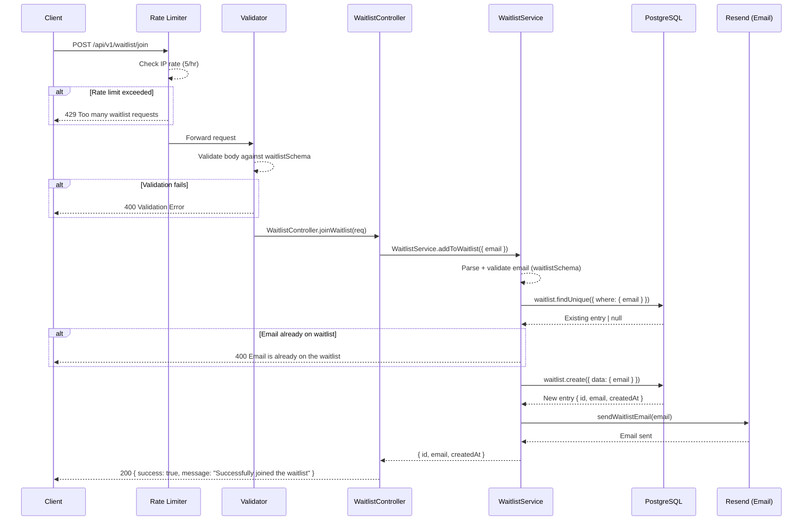

# Global Waitlist API

Base path: `/api/v1/waitlist`

---

## POST `/api/v1/waitlist/join`

**Join Product Waitlist**

| Property   | Value                                       |
| ---------- | ------------------------------------------- |
| Auth       | None (public endpoint)                       |
| Rate Limit | `waitlistLimiter` — 5 req / hr per IP       |
| Validator  | `waitlistSchema`                            |

### Flow Diagram



### Request

**Headers**

| Header       | Value            | Required |
| ------------ | ---------------- | -------- |
| Content-Type | application/json | Yes      |

**Body**

| Field | Type   | Constraints        | Required |
| ----- | ------ | ------------------ | -------- |
| email | string | Valid email address | Yes      |

### Response

**200 OK**

```json
{
  "success": true,
  "message": "Successfully joined the waitlist"
}
```

**400 Bad Request**

```json
{
  "success": false,
  "error": "Email is already on the waitlist"
}
```

**429 Too Many Requests**

```json
{
  "success": false,
  "error": {
    "message": "Too many waitlist requests, please try again later",
    "code": "RATE_LIMIT_EXCEEDED",
    "retryAfter": 3600
  }
}
```

### Notes

- Public endpoint — no authentication required.
- After successfully adding the email, a confirmation email is sent via Resend.
- Unique constraint on `email` prevents duplicate entries.
- The rate limiter is stricter (5 per hour) compared to other endpoints since this is a public, unauthenticated endpoint.
- The `Waitlist` model is for the global product waitlist (pre-launch), separate from per-idea waitlists.

### Frontend Usage

| Component | Path |
| --------- | ---- |
| Waitlist | `frontend/components/Waitlist.tsx` — joins waitlist via `waitlistApi.joinWaitlist()` |
